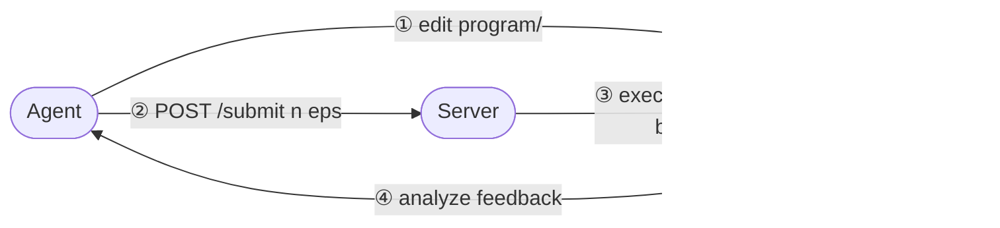

# EvoPolicyGym — Anonymous Review Artifact

This repository contains the v0.3.0 implementation supplied for peer review.
It provides a standardized evaluation protocol and a unified interface to
interactive environments for coding agents that evolve executable policies.
This snapshot does not include historical paper experiments or their results.

See the [local documentation](docs/index.md) and [review guide](REVIEW.md).

## What it measures

1. **Write** a complete executable Policy.
2. **Experiment** within a fixed Episode budget.
3. **Learn** from bounded, public Feedback.
4. **Publish** candidates before private evaluation begins.
5. **Generalize** when the Host selects on Validation and assesses only the
   selected Program on held-out Episodes.

EvoPolicyGym brings heterogeneous interactive environments under a common
Benchmark contract and records the complete trajectory of Programs,
Submissions, Feedback, selection, and outcomes. Reproducible Runs support both
fair Agent evaluation and rollout datasets for RL and other post-training
methods.

## How it works



The Agent can edit the Program, inspect public Feedback, and submit or finish
through its scoped Session client. The Host owns the Episode pool, budget,
Evaluation lifecycle, private final selection, and retained evidence.
The Unix-socket listener only transports framed requests; the calling Host
coordinator thread performs Environment evaluation and Feedback publication.
CLI Runs therefore keep renderers that require macOS main-thread access off
the transport listener thread.
The Host task declares `evopolicygym-session submit` as the Agent's only
authorized Benchmark Environment interaction path; directly running a local
Benchmark implementation, environment provider, simulator, ROM, or equivalent
mechanism is forbidden and does not constitute a budgeted experiment.

### Active experimentation under a budget

Every Run gives the Agent a fixed Episode budget and a deterministic pool of
selectable Episode identities. The Agent actively allocates this budget
between exploration, comparison, and confirmation. Reusing an Episode index
enables a matched comparison between Programs, but every use creates a fresh
Environment and Policy runtime and consumes another budget unit. The
underlying scenarios and seeds remain Host-owned. Validation and Assessment
use separate private allocations after the Agent has finished.

Episode budget makes interaction efficiency comparable within one Benchmark;
it is not a cross-Benchmark measure of compute cost.

When `max_submissions` is omitted, it defaults to `episode_budget`. This keeps
single-Episode experiments from exhausting Submission authority before the
Episode budget. Set it explicitly only when a Run needs a tighter limit on
distinct candidate evaluations.

`RunConfig.finish_budget_policy` controls whether the Agent may hand candidates
to the Host before using every Episode unit. The default, `allow_early`, keeps
the budget as a maximum and lets the Agent stop when further experimentation is
not worthwhile. `require_budget_exhaustion` turns it into a required allocation:
an early `finish` returns `budget_remaining` without closing Agent authority,
and the Agent must continue submitting until `episodes_remaining` reaches zero.
The strict policy also rejects submission sizes that would make full budget
use impossible within the remaining Submission limit.

## Quickstart

EvoPolicyGym requires Python 3.12 and
[`uv`](https://docs.astral.sh/uv/) 0.11.16. Open the extracted review repository and install the
independent CartPole Benchmark:

```console
# From the extracted review archive:
cd anonymous-policy-benchmark
uv sync --project environments/gymnasium/classic_control/cartpole --extra dev
```

Run one deterministic Evaluation of its packaged baseline:

```console
uv run --project environments/gymnasium/classic_control/cartpole python - <<'PY'
from cartpole import CartPoleBenchmark, baseline_program
from evopolicygym import EvaluationConfig, evaluate
from evopolicygym.execution import ProcessExecution

result = evaluate(
    baseline_program(),
    CartPoleBenchmark(),
    execution=ProcessExecution.unsafe(),
    config=EvaluationConfig(episodes=5, seed=42),
)
print(result.feedback.score)
print(result.feedback.content)
PY
```

A Policy Program is an immutable snapshot of a source directory whose
`policy.py` defines `make_policy(context)`. See the
[Policy guide](docs/policy.md) to write
one.

> `ProcessExecution` is not a sandbox. Policy and Agent processes run with the
> authority of the current operating-system user; use it only with trusted
> code. Its Agent instructions prohibit out-of-Session Environment interaction,
> but this is a normative prompt rule rather than an isolation guarantee.

## Run a coding agent

First-party command-line integrations are available for Codex, Claude Code,
Kimi Code, and Qoder:

```python
from evopolicygym.agents import ClaudeCode, Codex, KimiCode, Qoder

codex = Codex(model="gpt-5.6-luna", reasoning_effort="high")
claude = ClaudeCode(model="sonnet", effort="high")
kimi = KimiCode(model="kimi-code/kimi-for-coding")
qoder = Qoder(model="performance", reasoning_effort="high")
```

Each selection translates the same Host-owned task into a non-interactive CLI
invocation; the Run protocol and process supervision remain provider-neutral.
Authenticate the selected CLI before starting a Run. Qoder automation may use
`QODER_PERSONAL_ACCESS_TOKEN`. For Kimi Code and Qoder, respectively set
`KIMI_CODE_HOME` or `QODER_CONFIG_DIR` to a caller-owned isolated directory
when retained CLI configuration and session history must not share state with
other Runs.

After authenticating the Codex CLI, start a small budgeted CartPole Run:

```console
mkdir -p runs
uv run --project environments/gymnasium/classic_control/cartpole \
  python scripts/run_cartpole_codex.py \
  --model gpt-5.6-luna \
  --reasoning-effort high \
  --record-to runs/cartpole-001 \
  --episode-budget 30 \
  --episode-pool-size 60 \
  --max-episodes-per-submission 10 \
  --validation-episodes-per-candidate 5 \
  --assessment-episodes 10 \
  --allow-unsafe-process
```

Public Evaluation and Run workflows use the Python SDK. During one active Run,
the Agent-facing `evopolicygym-session` command provides only two capabilities:

```python
from evopolicygym.run import RunConfig, run
```

`run()` is owned by the `evopolicygym.run` use-case package and is not exported
from the root package, avoiding a function/submodule name collision.

```console
evopolicygym-session submit program --episodes "0:2,4:8"
evopolicygym-session finish submission-000002 submission-000003
```

`submit` requests an experiment over selected Run-local Episode indices.
`finish` hands published candidates to the Host and permanently closes Agent
authority before private Validation and Assessment. Runs configured with
`finish_budget_policy="require_budget_exhaustion"` reject `finish` while any
Episode budget remains; the rejection is retryable and does not change the
candidate set.

For AI-assisted setup, SDK usage, provider integration, Benchmark authoring,
and Run diagnostics, use the reusable
[`evopolicygym` Agent Skill](skills/evopolicygym/).

Large reproducible Feedback files may declare `retention="bulk"`. A Run
applies `bulk_feedback_retention_bytes` across the Host record and Agent mirror,
evicts only old bulk files, and always protects the newest submission. Compact
Feedback, permanent Artifacts, and Agent-owned work under `workspace/analysis/`
remain available. Host-only Validation and Assessment reports retain aggregate
Benchmark Feedback content but never publish it back into the Agent Session.

## Benchmarks

Benchmark distributions are independent packages built on the public
EvoPolicyGym authoring API.

| Collection | Coverage |
| --- | --- |
| [ARC Prize / ARC-AGI-3](environments/arcprize/arc_agi_3/) | All 25 version-pinned public interactive games plus custom collections |
| [AtCoder AHC](environments/atcoder/) | AHC054, AHC057, and AHC058 |
| [CodeChef Challenges](environments/codechef/) | WAREHOUS |
| [Crafter](environments/crafter/) | Canonical achievement, long-horizon development, and survival-development profiles |
| [DeepMind Control Suite](environments/dm_control/) | All 28 official benchmarking tasks across 14 continuous-control domains |
| [Gymnasium Box2D](environments/gymnasium/box2d/) | LunarLander, BipedalWalker, and CarRacing |
| [Gymnasium Classic Control](environments/gymnasium/classic_control/) | CartPole, Acrobot, Mountain Car, and Pendulum |
| [Gymnasium MuJoCo](environments/gymnasium/mujoco/) | All eleven current `v5` tasks |
| [Gymnasium Toy Text](environments/gymnasium/toy_text/) | Blackjack, CliffWalking, FrozenLake, and Taxi |
| [MiniGrid and BabyAI](environments/minigrid/) | Standard MiniGrid families, all 22 WFC presets, and 40 BabyAI tasks |
| [HighwayEnv](environments/highway_env/) | All ten canonical single-agent tasks |
| [Gymnasium-Robotics](environments/gymnasium_robotics/) | Fetch, Maze, Adroit, Shadow Hand, and FrankaKitchen profiles |
| [MetaWorld](environments/metaworld/) | All 50 MT1 tasks, MT10, MT50, and custom collections |
| [robosuite](environments/robosuite/) | All 19 registered single-arm and two-arm Panda manipulation environments |
| [NLE](environments/nle/) | Linux-targeted NetHackScore-v0 with complete semantic trajectory Feedback |
| [ALE](environments/ale/) | Redistributable Tetris profile |
| [ViZDoom](environments/vizdoom/) | 12 wheel-bundled standard scenarios |
| [Stable-Retro](environments/stable_retro/) | Redistributable Airstriker Level 1 profile |
| [Jackdaw](environments/jackdaw/) | Balatro (`run-score-v3`: Blinds cleared, doubled on a win) |

See the [environment catalog](environments/) and
[integration ledger](environments/STATUS.md) for complete coverage.

## Author a Benchmark

External distributions implement the structural `Benchmark` and `Environment`
interfaces from `evopolicygym.authoring`. A Benchmark owns deterministic
Episode planning, scoring, sanitized Feedback, and public Artifacts; an
Environment owns reset, step, and cleanup behavior. Typed environment
configuration is fixed before a Run and recorded in the Benchmark identity.

Use `check_benchmark()` before distribution. See the
[authoring guide](docs/authoring.md) and
the [CartPole](environments/gymnasium/classic_control/cartpole/) or
[FrozenLake](environments/gymnasium/toy_text/frozen_lake/) packages.

## Development

```console
uv sync --extra dev
uv run ruff check src tests
uv run mypy
uv run python -m unittest discover -s tests
uv build
```

EvoPolicyGym 0.3 is an alpha release and does not provide process isolation,
crash recovery, or Run resumption. Read [CONTRIBUTING.md](CONTRIBUTING.md) and
[SECURITY.md](SECURITY.md) before changing runtime behavior.

## License

The EvoPolicyGym Kernel is released under the [MIT License](LICENSE).
Environment distributions may include separately attributed dependencies; see
their package documentation for details.
